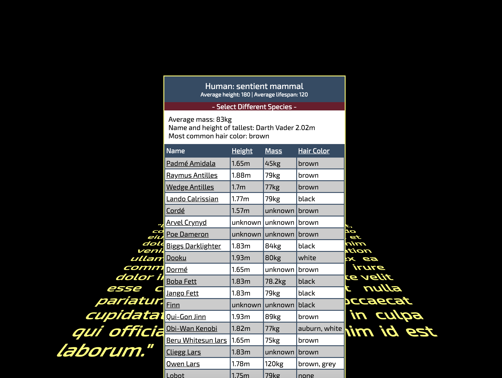

# Star Wars API Test
Working with [SWAPI, the Star Wars api](https://swapi.co/), used JavaScript to select all species and display all characters of selected species. Also, the ability to sort by field and to click on the character to see their home world information.

## Example

  
  

